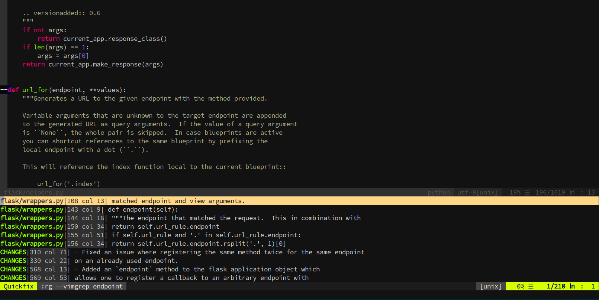

# neovim-config
A Neovim configuration inspired by Spacemacs

## Fuzzy searching

#### Fuzzy searching for text in project files

#### Fuzzy searching for recently opened files

## Search and replace across files

Search and replace with Ripgrep. Yes, you can edit in the quickfix buffer, and save it, and the changes will be applied on those lines across files (thanks to quickfix-reflector). It's amazing for refactoring.

## Linting with ALE

#### Errors in the gutter

#### Errors in the quickfix window

