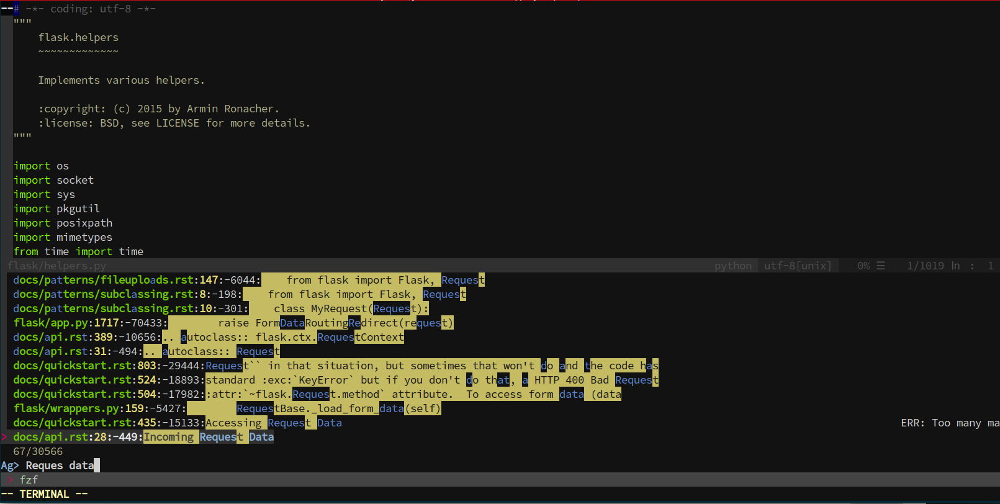
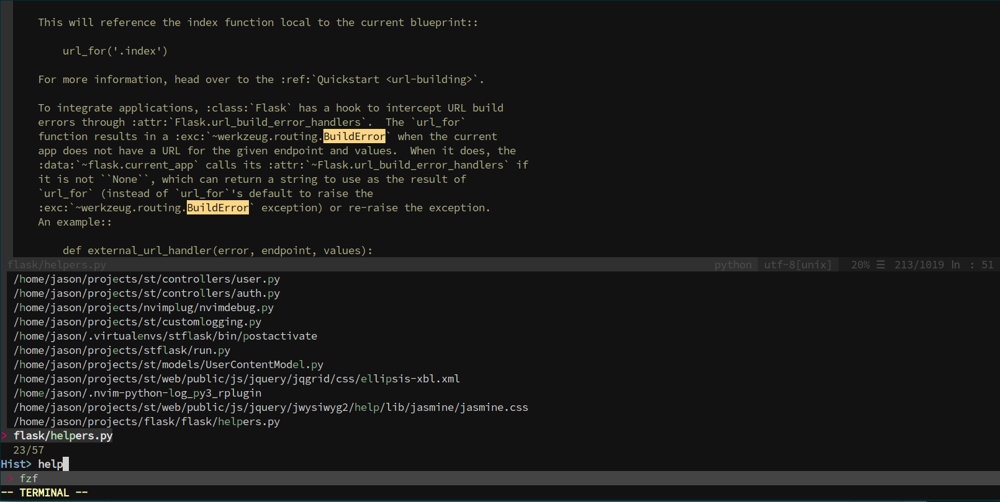
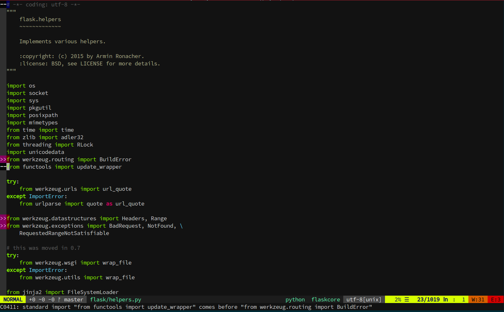
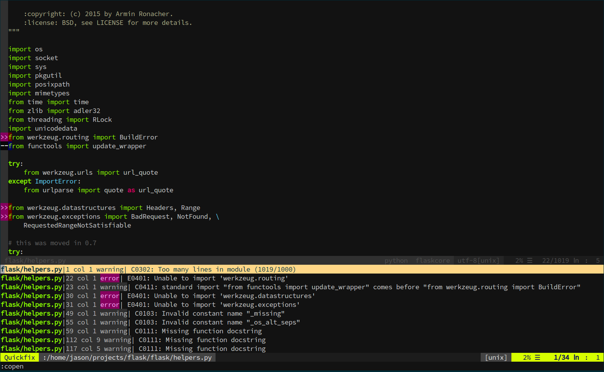

# neovim-config
A Neovim configuration inspired by Spacemacs

## Fuzzy searching

#### Fuzzy searching for text in project files

#### Fuzzy searching for recently opened files

## Linting with ALE

#### Errors in the gutter

#### Errors in the quickfix window

